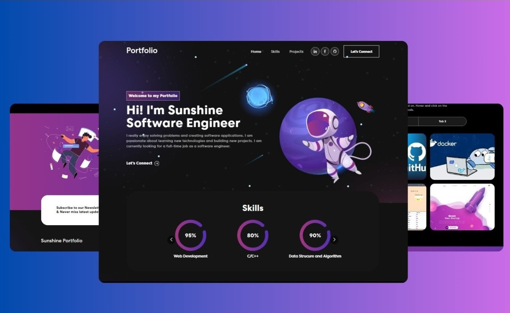

# Personal Portfolio Website in React

This project was bootstrapped with [Create React App](https://github.com/facebook/create-react-app).

Built using:

- Front-end library: React
- CSS framework: React-bootstrap
- CSS animations library: Animate.css

In the /personal-portfolio, install the required dependencies using:

### `npm install`

To run the project, use:

### `npm start`

Runs the app in the development mode.\
Open [http://localhost:3000](http://localhost:3000) to view it in your browser.

The page will reload when you make changes.\
You may also see any lint errors in the console.

### `npm test`

Launches the test runner in the interactive watch mode.\
See the section about [running tests](https://facebook.github.io/create-react-app/docs/running-tests) for more information.

### `npm run build`

Builds the app for production to the `build` folder.\
It correctly bundles React in production mode and optimizes the build for the best performance.

The build is minified and the filenames include the hashes.\
Your app is ready to be deployed!

See the section about [deployment](https://facebook.github.io/create-react-app/docs/deployment) for more information.

<!-- 
- Nếu bị lỗi Judy (web ban đầu) thì phải tải npm install gh-pages --save-dev  
- Để update trang web thì phải chạy 

$ git add .
$ git status // to see what changes are going to be commited
$ git commit -m 'Some descriptive commit message'
$ git push origin main

$ git checkout gh-pages // go to the gh-pages branch
$ git rebase main // bring gh-pages up to date with main
$ git push origin gh-pages // commit the changes
$ git checkout main // return to the main branch

hoặc npm run deploy --dev-save
hoặc npm run deploy
--->
